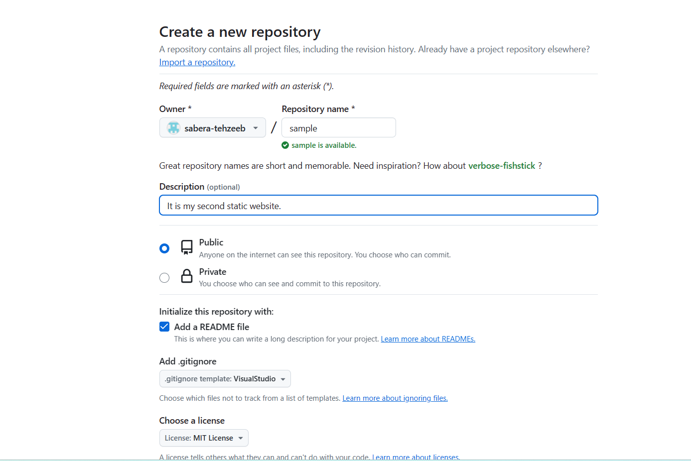
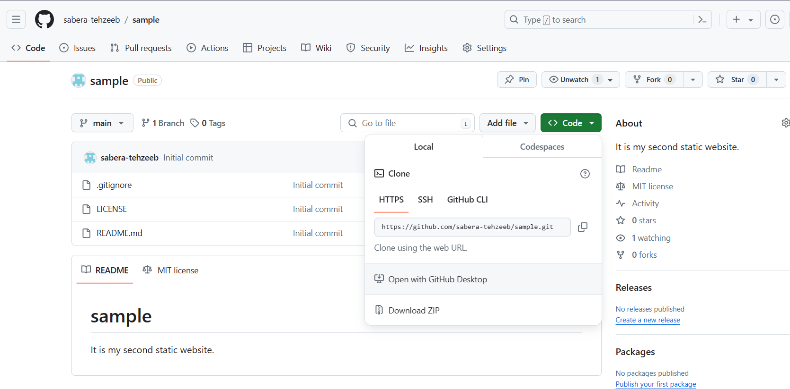
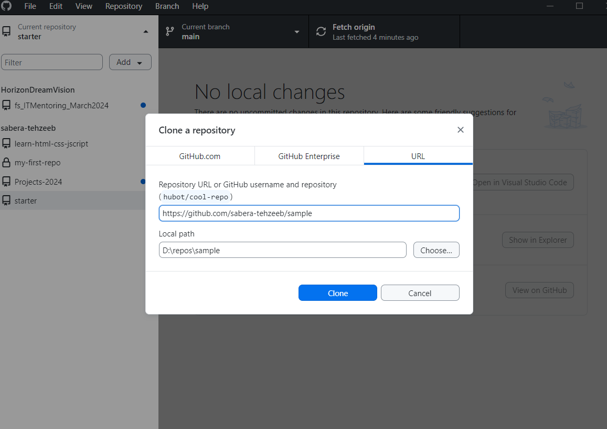
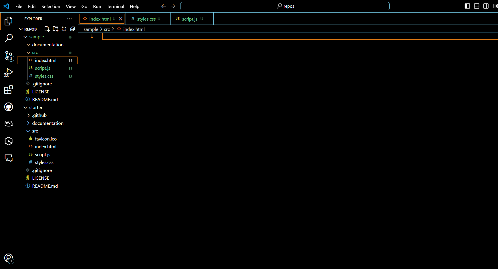

# Sample HTML Website in github pages

It is my second static website.

## Section 1

### Step-1: Create a Repository namely Sample



### Step-2: Cloning the Repository into github Desktop





### Step-3: Opening in Visual Studio Code Editor

#### Creating two folders namely
>
> 1. `documentation`- Documentaion
> 1. `src`- Source Code
>
#### 1.  Documentaion Folder will contain Images Folder

#### 2. Source Folder will contain files namely
>
> 1. `index.html`
> 1. `styles.css`
> 1. `srcipt.js`



## Section 2


### Code in index.html

```HTML
<!DOCTYPE html>
<html lang="en">

<head>
    <meta charset="UTF-8">
    <meta name="viewport" content="width=device-width, initial-scale=1.0">
    <link rel="icon" href="favicon.ico" type="image/x-icon">
    <link rel="stylesheet" href="https://cdnjs.cloudflare.com/ajax/libs/font-awesome/6.5.2/css/all.min.css"
        integrity="sha512-SnH5WK+bZxgPHs44uWIX+LLJAJ9/2PkPKZ5QiAj6Ta86w+fsb2TkcmfRyVX3pBnMFcV7oQPJkl9QevSCWr3W6A=="
        crossorigin="anonymous" referrerpolicy="no-referrer" />
    <link rel="stylesheet" href="styles.css" />
    <title>Jewellery Shop </title>
</head>

<body>
    <div>
        <h1>Sabera's Jewellery Shop <i class="fa-solid fa-gem"></i></h1>

    </div>

    <script src="script.js"></script>
</body>

</html>
```

### Code in styles.css

```CSS
@import url('https://fonts.googleapis.com/css2?family=Roboto:wght@400;700&display=swap');
@import url('https://fonts.googleapis.com/css2?family=Montserrat:wght@900&display=swap');

* {
    box-sizing: border-box;
}

body {
    font-family: 'Roboto', 'Montserrat', sans-serif;
    display: flex;
    flex-direction: column;
    align-items: center;
    height: 100vh;
    justify-content: center;
    overflow: hidden;
    margin: 0;
}

h1 {
    font-size: 3rem;
    margin-bottom: 1rem;
    color: #1;
    
}

h1 {
    font-size: 3rem;
    margin-bottom: 1rem;
    color:#124076;
}

i {
    font-size: 5rem;
    margin-bottom: 1rem;
    color: #7F9F80;
}
```

### Code in script.js

```JavaScript

console.log(`${Date()} :: This is a starter template for a simple web app.`);
```
